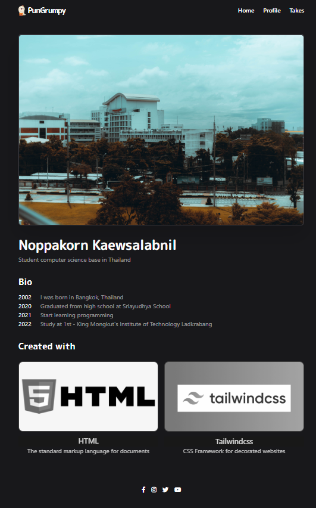

# Landing Profile

This is a Landing Profile



## Project structure

```
├── public
├── src
│   ├── index.html
│   ├── app.js
│   ├── style.css
├── tailwind.config.js
├── package.json
├── yarn.lock
└── README.md
```

## Created with

- [HTML](https://developer.mozilla.org/en-US/docs/Web/HTML)
- [TailwindCss](https://tailwindcss.com/)
- [PostCSS](https://postcss.org/)
- [Parcel](https://parceljs.org/)
- [Prettier](https://prettier.io/)
- [Yarn](https://yarnpkg.com/)
- [VSCode](https://code.visualstudio.com/)

## How to use this project

### 1. Clone this repository and run into project

```bash
git clone https://github.com/PunGrumpy/Landing-Profile.git
cd Landing-Profile
```

### 2. Install dependencies

```bash
yarn install
```

### 3. Start development server

```bash
yarn run dev
```

## License

You can use this project as you want, but don't forget to give me a star ⭐️ and follow me on [GitHub](https://github.com/PunGrumpy/)

[MIT](LICENSE) © [PunGrumpy](https://github.com/PunGrumpy/) - 2022 All rights reserved 🚀

## Author

[PunGrumpy](https://github.com/PunGrumpy/)
